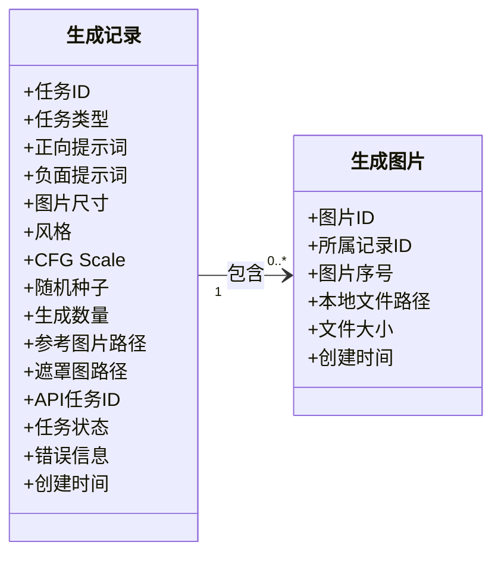
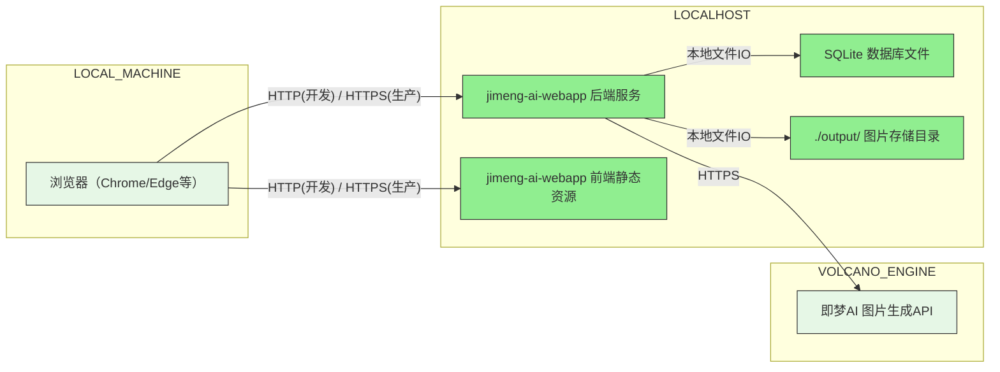
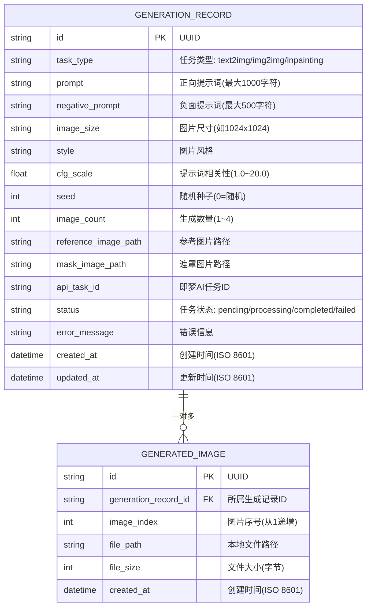

## 1. 文档概述

### 1.1 系统基本信息

| 项目 | 内容 |
| --- | --- |
| 系统中文名 | 即梦AI图片生成系统 |
| 系统英文名 | jimeng-ai |
| 子系统中文名 | 即梦AI图片生成系统子系统 |
| 子系统英文名 | jimeng-ai |

### 1.2 系统定位

#### 1.2.1 核心功能

即梦AI图片生成系统面向个人用户及小团队，提供基于即梦AI（火山引擎）API的文生图、图生图、局部重绘等AI图片生成与编辑能力，并通过Web界面提供便捷的操作体验。

| **功能模块** | **功能描述及实现流程** |
| ------------ | --------------------- |
| 文生图 | 用户在Web页面输入正向/负面提示词，选择图片尺寸、数量、风格、CFG Scale和Seed值，提交后系统异步调用即梦AI文生图API，轮询获取结果并展示和保存图片。 |
| 图生图 | 用户上传参考图片并输入提示词，系统将图片编码后调用即梦AI图生图API，生成与参考图片相关的新图片。 |
| 局部重绘 | 用户上传图片后，在画布上用画笔标记重绘区域，系统生成遮罩图并调用即梦AI局部重绘API，实现"指哪改哪"的局部修改。 |
| 历史记录管理 | 系统自动记录每次生成任务的信息（提示词、参数、结果图片等），支持按时间倒序查看、详情浏览和单条删除。 |

#### 1.2.2 参考文档

| 文档名称 | 文档链接 | 关联章节 | 用途 |
|---------|--------|---------|------|
| 系统需求规格说明书 | ../../.cospec/spec/jimeng-ai-integration/requirement.md | 全部 | 需求依据 |
| 即梦AI-图片生成4.6-接口文档 | https://www.volcengine.com/docs/85621/2275082?lang=zh | 3.2 | 第三方接口依赖 |

---

## 2. 总体设计

### 2.1 系统架构总览

#### 2.1.1 领域模型



**领域模型说明**：

- **生成记录（GenerationRecord）**：单次图片生成请求的全量信息实体，记录每次API调用的参数、状态和结果。是系统的核心业务对象。
- **生成图片（GeneratedImage）**：单次生成产出的单张图片的元数据实体。一次生成（生成记录）可产出多张图片（如选择生成4张）。

#### 2.1.2 架构视图

##### 部署视图（Physical View）



#### 2.1.3 项目目录结构

```
jimeng-ai-webapp/         # 项目根目录
├── frontend/              # 前端工程
│   ├── src/
│   │   ├── api/           # 后端接口请求封装
│   │   ├── assets/        # 静态资源（图片/样式/字体）
│   │   ├── components/    # 公共可复用组件（画布组件等）
│   │   ├── layouts/       # 页面布局组件
│   │   ├── router/        # 前端路由配置
│   │   ├── stores/        # 全局状态管理（Pinia）
│   │   ├── utils/         # 前端工具函数
│   │   └── views/         # 业务页面（文生图/图生图/局部重绘/历史记录）
│   ├── public/            # 静态入口资源
│   ├── index.html         # 主入口HTML
│   ├── Dockerfile         # 前端Dockerfile
│   ├── nginx.conf         # 前端nginx配置
│   └── package.json       # 前端依赖配置
├── backend/               # 后端工程（Python FastAPI）
│   ├── app/
│   │   ├── api/           # API路由层
│   │   │   └── v1/        # API v1版本路由
│   │   ├── core/          # 核心配置（配置、鉴权、异常处理）
│   │   ├── models/        # SQLAlchemy数据模型
│   │   ├── schemas/       # Pydantic请求/响应模型
│   │   ├── services/      # 业务逻辑层（图片生成、文件管理、历史记录）
│   │   ├── integration/   # 第三方集成（即梦AI API客户端）
│   │   └── utils/         # 工具函数
│   ├── output/            # 生成图片输出目录
│   ├── data/              # SQLite数据库文件目录
│   ├── .env               # 环境变量配置文件（AK/SK配置）
│   ├── requirements.txt   # Python依赖
│   ├── Dockerfile         # 后端Dockerfile
│   └── main.py            # 应用启动入口
├── .gitignore             # Git忽略配置
└── README.md              # 项目说明文档
```

### 2.2 技术选型

| 层级 | 分类 | 是否涉及 | 技术栈 | 版本 | 开源/商用 |
|--------|----------------|----------|-----------------------|----------|-----------|
| 前端 | 开发语言 | 是 | JavaScript / TypeScript | 5.x | 开源 |
| 前端 | 开发框架 | 是 | Vue | 3.x | 开源 |
| 前端 | 开源组件 | 是 | Element Plus | 最新稳定版 | 开源 |
| 前端 | 构建组件 | 是 | Vite | 5.x | 开源 |
| 前端 | 开源组件 | 是 | Pinia | 最新稳定版 | 开源 |
| 前端 | 开源组件 | 是 | Axios | 最新稳定版 | 开源 |
| 后端 | 开发语言 | 是 | Python | 3.11+ | 开源 |
| 后端 | 开发框架 | 是 | FastAPI | 最新稳定版 | 开源 |
| 后端 | 开源组件 | 是 | Uvicorn | 最新稳定版 | 开源 |
| 后端 | 开源组件 | 是 | SQLAlchemy | 最新稳定版 | 开源 |
| 后端 | 开源组件 | 是 | Pydantic | 最新稳定版 | 开源 |
| 后端 | 开源组件 | 是 | volcengine-python-sdk | 最新稳定版 | 开源 |
| 后端 | 构建组件 | 是 | pip | 最新稳定版 | 开源 |
| 数据库 | 关系数据库 | 是 | SQLite | 3.x | 开源 |
| 基础设施 | 操作系统 | 是 | Windows/Linux/macOS | - | - |

### 2.3 发布单元列表

| 发布单元英文名 | 发布单元中文名 | 部署区域 | 部署模式 | 配置 | 节点数 |
|----------------|---------------|---------|---------|------|--------|
| jimeng-ai-webapp | 即梦AI图片生成Web应用（包含前端+后端） | localhost | 本地单机部署 | 按本地机器配置 | 1 |

### 2.4 资源规划

#### 2.4.1 推导过程

1. **容量口径（系统总体）**：
   - 预估用户数：100人
   - 日活用户（DAU）：30（按30%日活率估算）
   - 图片生成请求：平均每人每天5次 = 150次/天
   - 高峰期：非固定，随用户使用波动

2. **系统峰值QPS计算**：
   - 图片生成请求属于异步长耗时操作（依赖即梦AI API处理时间，通常10~60秒），不适用传统QPS模型
   - Web页面浏览/历史记录查询为轻量操作，单用户操作频率极低
   - 无需额外计算容器规模

3. **存储需求**：
   - 数据库（SQLite）：仅存储元数据，预估年增长 < 100MB
   - 图片存储：按平均每张图片5MB，每天150张估算，年增长约 5MB × 150 × 365 ≈ 274GB
   - 建议本地磁盘容量 ≥ 500GB（含系统运行空间）

#### 2.4.2 资源需求

| 组件 | 规格/数量 | 关键依据 |
|------|----------|----------|
| 操作系统 | 主流OS（Windows/Linux/macOS） | 本地部署 |
| CPU | 4核及以上 | 同时处理图片生成任务和Web服务 |
| 内存 | 8GB及以上 | 运行时内存开销 |
| 磁盘 | 500GB及以上 | 图片存储年增长约274GB |
| Python运行环境 | Python 3.11+ | 后端技术选型 |
| Node.js运行环境 | Node.js 18+ | 前端构建 |
| 域名 | 不涉及 | 本地部署，localhost访问 |

---

## 3. API接口设计

### 3.1 OpenAPI对外接口

无

> 本系统为单机本地部署的个人级应用，不对外提供OpenAPI接口。

### 3.2 依赖的外部接口

| 接口名称 | 接口提供方 | 接口说明 | 协议 |
|---------|-----------|---------|------|
| 即梦AI-图片生成API | 火山引擎（即梦AI） | 文生图/图生图/局部重绘等图片生成能力的异步API调用 | HTTPS/RESTful |
| 即梦AI-任务查询API | 火山引擎（即梦AI） | 查询图片生成任务状态的轮询接口 | HTTPS/RESTful |
| 即梦AI-图片上传API | 火山引擎（即梦AI） | 上传参考图片获取URL（图生图/局部重绘场景） | HTTPS/RESTful |

**集成方式**：
- 通过火山引擎Python SDK（volcengine-python-sdk）进行API调用
- 鉴权方式：HMAC-SHA256签名（AccessKey/SecretKey）
- 数据格式：JSON

---

## 4. 数据模型设计

### 4.1 核心数据模型



### 4.2 数据表定义

#### 4.2.1 生成记录表（generation_records）

| 字段名 | 类型 | 约束/索引 | 字段说明 |
|-------|------|----------|---------|
| id | VARCHAR(36) | PK | UUID主键 |
| task_type | VARCHAR(20) | NOT NULL, INDEX | 任务类型：text2img / img2img / inpainting |
| prompt | TEXT | NOT NULL | 正向提示词，最大1000字符 |
| negative_prompt | TEXT | NULL | 负面提示词，最大500字符 |
| image_size | VARCHAR(20) | NOT NULL | 图片尺寸，格式"宽x高" |
| style | VARCHAR(50) | NULL | 图片风格名称 |
| cfg_scale | FLOAT | NOT NULL, DEFAULT 7.0 | 提示词相关性，范围1.0~20.0 |
| seed | INTEGER | NOT NULL, DEFAULT 0 | 随机种子，0表示随机 |
| image_count | INTEGER | NOT NULL, DEFAULT 1 | 生成数量，1~4 |
| reference_image_path | VARCHAR(500) | NULL | 参考图片本地路径，仅img2img/inpainting |
| mask_image_path | VARCHAR(500) | NULL | 遮罩图本地路径，仅inpainting |
| api_task_id | VARCHAR(100) | NOT NULL, INDEX | 即梦AI返回的任务ID |
| status | VARCHAR(20) | NOT NULL, DEFAULT 'pending', INDEX | 任务状态：pending/processing/completed/failed |
| error_message | TEXT | NULL | 失败时的错误描述 |
| created_at | DATETIME | NOT NULL, DEFAULT CURRENT_TIMESTAMP | 创建时间 |
| updated_at | DATETIME | NOT NULL, DEFAULT CURRENT_TIMESTAMP | 更新时间 |

#### 4.2.2 生成图片表（generated_images）

| 字段名 | 类型 | 约束/索引 | 字段说明 |
|-------|------|----------|---------|
| id | VARCHAR(36) | PK | UUID主键 |
| generation_record_id | VARCHAR(36) | NOT NULL, FK, INDEX | 关联generation_records.id |
| image_index | INTEGER | NOT NULL | 图片序号，从1开始递增 |
| file_path | VARCHAR(500) | NOT NULL | 本地文件相对路径 |
| file_size | INTEGER | NULL | 文件大小（字节） |
| created_at | DATETIME | NOT NULL, DEFAULT CURRENT_TIMESTAMP | 创建时间 |

**索引设计**：

| 表名 | 索引名 | 索引字段 | 类型 |
|------|--------|---------|------|
| generation_records | idx_task_type | task_type | 普通索引 |
| generation_records | idx_status | status | 普通索引 |
| generation_records | idx_api_task_id | api_task_id | 普通索引 |
| generation_records | idx_created_at | created_at | 普通索引 |
| generated_images | idx_generation_record_id | generation_record_id | 普通索引 |

---

## 5. 系统集成

### 5.1 系统整体架构图

```mermaid
graph TD
    subgraph 用户环境
        BROWSER[浏览器（Chrome/Edge等）]
    end

    subgraph 本地主机
        subgraph 前端服务
            VUE_APP[Vue3前端应用（Vite构建）]
        end
        subgraph 后端服务
            FASTAPI[FastAPI Web服务]
            INTEGRATION[即梦AI SDK集成模块]
        end
        subgraph 本地存储
            SQLITE_DB[(SQLite数据库)]
            OUTPUT[图片输出目录 ./output/]
        end
    end

    subgraph 火山引擎（即梦AI）
        JIMENG_API[即梦AI图片生成API]
        JIMENG_QUERY[即梦AI任务查询API]
        JIMENG_UPLOAD[即梦AI图片上传API]
    end

    BROWSER -->|HTTP| VUE_APP
    BROWSER -->|HTTP| FASTAPI
    FASTAPI -->|读写| SQLITE_DB
    FASTAPI -->|写入| OUTPUT
    INTEGRATION -->|HTTPS/HMAC-SHA256| JIMENG_API
    INTEGRATION -->|HTTPS| JIMENG_QUERY
    INTEGRATION -->|HTTPS| JIMENG_UPLOAD
```

### 5.2 集成方式

#### 5.2.1 即梦AI火山引擎集成

1. **前置条件**：
   - 用户需在火山引擎控制台开通即梦AI服务
   - 申请并获取AccessKey和SecretKey
   - 在项目根目录的`.env`文件中配置以下环境变量：
     ```
     VOLC_ACCESS_KEY=your_access_key_here
     VOLC_SECRET_KEY=your_secret_key_here
     ```

2. **集成方式**：
   - 通过`volcengine-python-sdk` SDK进行API调用
   - 鉴权方式：HMAC-SHA256签名认证
   - 调用链路：Python后端 → SDK封装 → HTTPS请求 → 即梦AI API

3. **API调用流程**：
   - **提交任务**：调用图片生成API，返回任务ID
   - **轮询结果**：通过任务ID轮询查询API，直到任务完成或超时
   - **结果处理**：下载生成的图片并保存到本地`./output/`目录

#### 5.2.2 本地存储集成

- **图片存储**：按`./output/YYYYMMDD/{task_id}_{index}.png`格式组织目录结构
- **数据库存储**：SQLite本地文件，存储在`./data/jimeng-ai.db`

---

## 6. 非功能设计

### 6.1 安全要求

| 参数 | 本系统情况 |
|------|-----------|
| 是否有安全协议和安全接口 | 生产环境建议HTTPS |
| 身份鉴别方式 | API密钥（AccessKey/SecretKey）的HMAC-SHA256签名 |
| 是否涉及数据加密 | 是（AK/SK存储在.env文件，禁止硬编码和日志输出） |
| 是否有敏感数据 | 是（火山引擎AK/SK密钥信息） |
| 敏感数据字段 | VOLC_ACCESS_KEY、VOLC_SECRET_KEY |
| 是否个人信息收集 | 否 |
| 隐私协议 | 无 |

### 6.2 性能指标

| 参数 | 内容 |
|------|------|
| 预估用户数 | 100人 |
| 页面/查询响应时间 | 95%的请求在2秒内完成 |
| 图片生成响应时间 | 取决于即梦AI API处理时间（通常10~60秒） |
| 数据年增长量 | 图片约274GB（按每天150张、每张5MB估算） |

### 6.3 监控方案

系统提供健康检查接口：
- **存活探针**：`GET /health` — 返回服务运行状态
- **就绪探针**：`GET /health/ready` — 返回服务及各依赖就绪状态

### 6.4 日志方案

- 使用Python标准logging模块
- 日志级别：生产环境默认INFO
- 日志输出：控制台 + 文件（`./logs/app.log`）
- 禁止在日志中输出AK/SK等敏感信息
- 关键业务节点记录INFO级别日志（任务提交、任务完成、异常等）

### 6.5 灾备方案

- 本地单机部署，不涉及多可用区容灾
- 建议用户定期备份`./data/`目录（SQLite数据库）和`./output/`目录（生成图片）

---

## 7. 变更记录

| 版本号 | 变更日期 | 变更人 | 变更类型 | 变更内容 |
|--------|---------|--------|---------|---------|
| V1.0 | 2025-07-01 | - | 新建系统 | 完成架构文档初稿编写 |